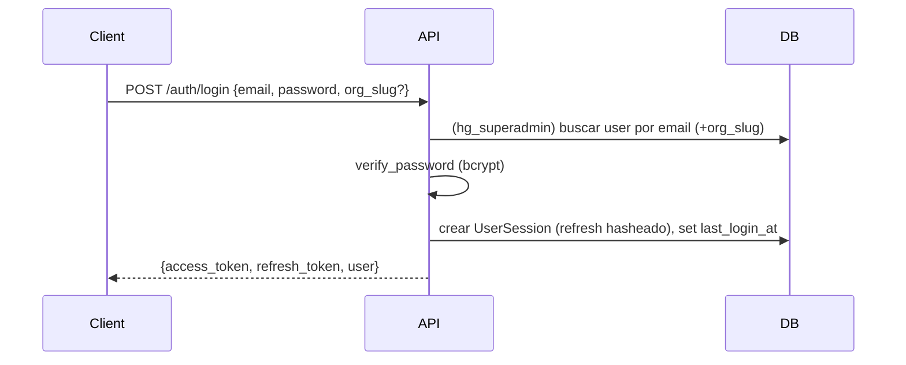
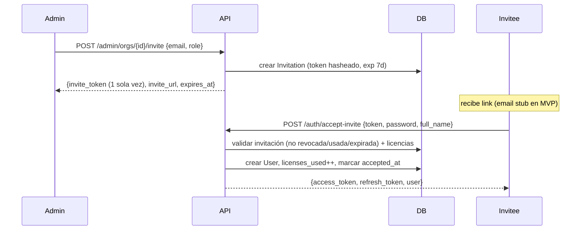

# Arquitectura — Human Growth (resumen operativo)

> Documento maestro: `HG/Artifacts/HG_Technical_Planning_v1.docx`. Este archivo es el resumen vivo para devs.

## Principios

1. **Monolito modular**, no microservicios. Cada módulo es extraíble.
2. **Multi-tenancy desde día 1**: toda tabla de dato de usuario lleva `org_id` + RLS.
3. **Append-only** para eventos de actividad (`activity_events`).
4. **Assessment de personalidad** es entidad de primera clase, no JSON suelto.
5. **AI ready**: Python en ambas capas (API + agentes), pgvector en la misma DB.

## Módulos de dominio

| Módulo | Responsabilidad | Extracción futura |
|---|---|---|
| identity | Auth, sesiones, roles, multi-tenancy | Si escala de auth lo requiere |
| people | Perfiles, jerarquía org, manager view | Con crecimiento de orgs grandes |
| learning | Cursos, paths, progreso, assessments | Primer candidato a extraer en Fase B |
| ai | Chatbot, RAG, personalización | Lambda/serverless desde inicio |
| notifications | Email, push, alertas de inactividad | Workers separados con Celery |
| analytics | Eventos de actividad, métricas, reportes | Data warehouse en Fase B |
| admin | Panel interno HG, feature flags, soporte | Permanece en monolito |

## Stack — versión rápida

- **Backend:** Python 3.12 · FastAPI · SQLAlchemy 2 · Alembic · Celery · Redis · psycopg3
- **DB:** PostgreSQL 16 (+ pgvector en Fase 1.5)
- **Frontend:** Next.js 14 (App Router) · TypeScript · Tailwind · shadcn/ui · Auth.js v5
- **Hosting MVP:** Railway · Vercel · Neon
- **Almacenamiento video:** Cloudflare R2 (S3 API) + CDN
- **Email:** Resend · **Errores:** Sentry · **Analytics:** PostHog

## Modelo de datos — capas

1. **Identidad** — `organizations`, `users`, `user_sessions`
2. **Perfil y Assessment** — `personality_assessments`, `user_learning_profiles`, `org_assessment_aggregate`
3. **Learning** — `pillars`, `career_paths`, `courses`, `enrollments`, `course_progress`, `pillar_assessments`
4. **Notifications** — `notification_log`, `email_templates`
5. **Activity** (append-only) — `activity_events`
6. **AI** (Fase 1.5) — `ai_conversations`, `course_embeddings`

Esquema completo: ver Technical Planning doc, sección 3.

## Capa 1 — Identity (DEV-03/04)

Implementada y migrada (Alembic). Es la única capa productiva por ahora; el
resto de los modelos (`learning`, `people`/assessments, `ai`, `analytics`)
están en estado **DRAFT** hasta firmar DEC-01/02/05/07.

### Tablas

| Tabla | RLS | Notas |
|---|---|---|
| `organizations` | — | Tabla raíz de tenant (no tiene `org_id`). Incluye `tier`, `country`, `billing_status`, `billing_cycle`, `contract_start/end`, `licenses_total/used`, `settings` (JSONB), `logo_url`, `primary_color`. |
| `users` | ✅ | `org_id NOT NULL` (FK→organizations). Unique `(org_id, email)` = `uq_users_org_email` (el mismo email puede existir en orgs distintas). Campos: `role`, `career_level`, `job_title`, `department`, `hire_date`, `manager_id` (auto-FK), `last_login_at`, `last_active_at`. |
| `user_sessions` | ✅ | `org_id` + `user_id NOT NULL`. `refresh_token_hash` único, `device_info` (JSONB), `ip_address`, `expires_at`, `revoked_at`. |

### Enums

- `user_role`: `superadmin`, `admin`, `manager`, `collaborator`
- `org_tier`: `A`, `B`, `C`
- `career_level`: `L1`, `L2`, `L3`, `L4a`, `L4b`

### Políticas RLS (DEV-04)

- `ENABLE` + `FORCE ROW LEVEL SECURITY` en `users` y `user_sessions`.
- Política `tenant_isolation` (USING + WITH CHECK):
  `org_id = NULLIF(current_setting('app.current_org_id', true), '')::uuid`.
- El contexto se fija por transacción con `set_config('app.current_org_id', …, true)`
  (helper `hg.core.tenancy.set_org_context`); `get_db` abre una transacción
  explícita para que `SET LOCAL` tenga efecto.
- Roles: `hg_app` (NOSUPERUSER/NOBYPASSRLS — rol de la app) y `hg_superadmin`
  (BYPASSRLS — operaciones internas/cross-tenant).

> ⚠️ El rol por defecto `hg` es superusuario y **bypassa RLS**. La conexión
> productiva de la app debe usar `hg_app`. Detalle y rationale en
> [ADR-0001](adrs/ADR-0001-uuid-and-rls.md).

### Migraciones

- `B1-03_layer1_identity.py` — esquema inicial (enums + tablas).
- `B1-04_enable_rls_multi_tenancy.py` — roles + RLS + políticas.

## Auth & RBAC (DEV-06/07)

Autenticación JWT (access + refresh) + registro por invitación (sin
self-service; ver [ADR-0002](adrs/ADR-0002-invitation-based-registration.md)).

### Endpoints

| Método | Ruta | Auth | Rol |
|---|---|---|---|
| POST | `/api/v1/auth/login` | pública | — |
| POST | `/api/v1/auth/refresh` | pública | — |
| POST | `/api/v1/auth/accept-invite` | pública | — |
| POST | `/api/v1/auth/logout` | refresh token | — |
| GET | `/api/v1/auth/me` | Bearer | cualquiera |
| POST | `/api/v1/admin/orgs` | Bearer | superadmin |
| GET | `/api/v1/admin/orgs` | Bearer | superadmin |
| POST | `/api/v1/admin/orgs/{id}/invite` | Bearer | superadmin · admin (su org) |
| GET | `/api/v1/admin/orgs/{id}/invitations` | Bearer | superadmin · admin (su org) |
| DELETE | `/api/v1/admin/invitations/{id}` | Bearer | superadmin · admin (su org) |

### Tokens y roles de DB

- **JWT claims:** `sub` (user_id), `org_id`, `role`, `type` (access|refresh),
  `iat`, `exp`, `jti`. Sin PII adicional.
- **Refresh tokens** se persisten **hasheados** (SHA-256) en
  `user_sessions.refresh_token_hash`. Login = nueva session; refresh = rota
  (revoca la vieja, crea una nueva); logout = `revoked_at`.
- **Rol de DB por request** (`SET LOCAL ROLE`): autenticado tenant-scoped →
  `hg_app` (RLS activo) + `app.current_org_id` del JWT; flujos sin sesión /
  cross-tenant (login, refresh, accept-invite, admin) → `hg_superadmin`
  (BYPASSRLS) + RBAC + checks de org. Ver
  [ADR-0001](adrs/ADR-0001-uuid-and-rls.md).
- **RBAC:** dependency `require_role(*roles)` valida `current_user.role`.

### Flujos

**Login**



**Refresh (rotación)**

```mermaid
sequenceDiagram
  Client->>API: POST /auth/refresh {refresh_token}
  API->>API: decode JWT (type=refresh)
  API->>DB: buscar session por sha256(token); validar no revocada/expirada
  API->>DB: revocar session vieja + crear session nueva
  API-->>Client: {access_token, refresh_token (nuevo), user}
```

**Accept-invite**



### Migraciones

- `B1-06_add_invitations_table.py` — tabla `invitations`.
- `B1-06b_enable_rls_on_invitations.py` — RLS sobre `invitations` + grants a
  `hg_superadmin`/`hg_app`.

## Frontend v1 (FE-01 → FE-08)

Next.js 14 (App Router) + TypeScript + Tailwind + el **design system beta**
adoptado como direction v1 (ver [ADR-0003](adrs/ADR-0003-design-system-beta-as-v1.md)).

### Stack

- Next.js 14 App Router · React 18 · TypeScript estricto.
- Tailwind con tokens del DS · `next/font` (Anton/Manrope/Instrument Serif/JetBrains Mono).
- Zustand (auth en memoria) · react-hook-form + zod · axios · Recharts · lucide-react.
- Tests: Vitest + Testing Library.

### Integración del DS (tokens-based)

- Fuente: `packages/design-system/source/` (copia del beta).
- Tokens operativos: `apps/frontend/src/app/globals.css` (`:root` + dark) y
  `apps/frontend/tailwind.config.ts`. Los componentes usan tokens semánticos
  (`bg`, `fg`, `border`, `orange-*`, pillars), nunca hex hardcodeado.
- **Swap a DEC-03 final:** editar esos 2 archivos (+ `next/font` si cambian las
  fuentes, + reemplazar `source/`). No se tocan componentes. Quitar `BetaBanner`.

### Páginas

| Ruta | Grupo | Estado |
|---|---|---|
| `/login`, `/accept-invite` | `(auth)` | ✅ |
| `/home` (dashboard 6 dimensiones) | `(app)` | ✅ |
| `/library` (filtros; grid vacío v1) | `(app)` | ✅ |
| `/profile` (radar 6 dims, mock scores) | `(app)` | ✅ |
| `/admin/orgs`, `/admin/orgs/:id` | `(admin)` | ✅ superadmin |
| `/_kit` (preview de componentes) | — | ✅ |
| Assessment, lección, mentorías, comunidades | — | ⏳ pendiente (post DEC-01/05) |

### Auth en el cliente

- Access token en **memoria** (Zustand); refresh token en **cookie httpOnly**
  gestionada por Next API routes `/api/auth/*` (login, refresh, logout,
  accept-invite). Interceptor axios auto-refresca una vez en 401.
- `middleware.ts` gatea `(app)`/`(admin)` por presencia de cookie; `SessionGate`
  rehidrata el access token (refresh-on-load) y valida; `(admin)` además exige
  rol `superadmin`.

### Pilares (colores DS)

P1 orange-500 · P2 warm-600 · P3 success · P4 warning · P5 info · P6 orange-800.

## Decisiones bloqueantes activas

| ID | Decisión | Bloquea |
|---|---|---|
| DEC-01 | Algoritmo de scoring del assessment | Motor de assessment |
| DEC-02 | Reglas de recomendación de path | Lógica de recomendación |
| DEC-03 | Identidad visual final | Todo el frontend |
| DEC-04 | Cliente piloto | Vista RRHH / piloto |
| DEC-05 | Contenido de los 20-25 escenarios | Onboarding |
| DEC-06 | ¿Diseñador UX externo? | Velocidad de wireframes |
| DEC-07 | Criterio de "pilar completado" | Lógica de progreso |

Ver `HG/Artifacts/HG_Kanban_v1.md` y `HG/Artifacts/HG_Backlog_Priorizado_v1.md`.
