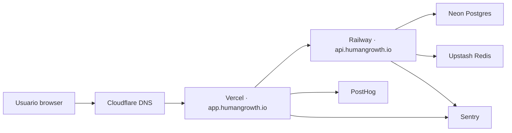

# Prompt para Claude Code · Sprint B · Lun PM + Mar (~6-8h)

> **Modo recomendado:** `/effort high` con **Claude Opus 4.8**.
> Despliegue productivo end-to-end. Muchas configuraciones manuales en consolas web — Andrés ejecuta, Claude Code prepara los archivos y verifica.

---

## ⚙️ Resume protocol

Si la sesión se compacta o reinicia:

1. Releé este prompt entero (vivís en `docs/prompts/claude-code_Sprint-B_deploy_productivo.md`).
2. Verificá estado:
   ```bash
   git status && git log --oneline -5
   docker compose ps
   curl -fsS https://api.humangrowth.io/health 2>&1 | head -5
   curl -fsS https://app.humangrowth.io/login 2>&1 | head -10
   ```
3. Releé "## 📌 Estado al iniciar" y "## 🧩 Inventario de servicios" abajo.
4. Buscá TASKs `🟧 IN PROGRESS` y reanudá.

## 🧱 Reglas duras

- **Un commit por TASK** de configuración. Conventional Commits: `chore(B-XX): ...` o `feat(B1-XX): ...`.
- **NUNCA commits con secretos.** Los secrets viven en variables de entorno de los servicios. Verificar 2× antes de cada `git add`.
- **Sub-commits intermedios** cada >30 min.
- **Editá ESTE archivo al avanzar.**
- **Andrés vs Claude:** los pasos marcados 👤 **Andrés** son clicks en consola web (Neon, Railway, Vercel, Cloudflare/registrar). Los demás son código + bash. Claude Code: prepará el archivo o comando exacto, después esperá a que Andrés diga "hecho".
- **TASKs idealmente en orden** B-01 → B-08; algunas tienen "wait points" mientras Andrés configura externos.

## 📌 Estado al iniciar

- Sprint A cerrado: `main` en GitHub al día, ISSUE-1 resuelto.
- Repo: `https://github.com/HumanGrowth/hg-platform`
- Dominio: **humangrowth.io** (Andrés controla DNS — confirmar registrar usado).
- Stack local docker 5/5 healthy reproducible.
- **Aún sin** infra cloud levantada.

## 🧩 Inventario de servicios

| Capa | Proveedor | URL final |
|---|---|---|
| Postgres | **Neon** | branches `main` (prod), `staging`, `dev` |
| Backend API + Worker Celery | **Railway** | `api.humangrowth.io` |
| Redis | **Upstash** (TLS) — más barato y simple que Railway Redis | URL `rediss://...` |
| Frontend Next.js | **Vercel** | `app.humangrowth.io` |
| DNS | Registrar de humangrowth.io + Cloudflare (recomendado) | — |
| Errores | **Sentry** (proyectos separados be/fe) | sentry.io |
| Analytics | **PostHog Cloud** | app.posthog.com |
| Email | **Resend** (stub-log por ahora; activar key cuando lleguen invitaciones reales) | resend.com |

**Antes de arrancar — confirmar / decidir:**
1. ¿Registrar de humangrowth.io? (GoDaddy / Namecheap / Cloudflare Registrar / otro) → Andrés.
2. ¿Vamos a usar Cloudflare como proxy DNS o solo apuntamos los CNAMEs nativos del registrar? Recomiendo Cloudflare (cache + HTTPS gratis + analytics básico).

---

# TASKS

## TASK B-01 · Provisionar Neon (Postgres) · `[ ]`

### 1.1 · 👤 Andrés crea proyecto Neon

1. `https://console.neon.tech` → New Project
2. Nombre: `hg-platform`
3. Region: `us-east-1` (cerca de Railway us-east)
4. Postgres version: 16
5. Compute: development tier (free) por ahora — migrar a paid tier antes del piloto

### 1.2 · 👤 Crear branches

En Neon UI:
- `main` (existe por default — será **producción**)
- `staging` (branch from main)
- `dev` (branch from main)

### 1.3 · Habilitar extensiones en `main`

👤 Andrés: en Neon SQL Editor para el branch `main`:

```sql
CREATE EXTENSION IF NOT EXISTS "uuid-ossp";
CREATE EXTENSION IF NOT EXISTS "pgcrypto";
CREATE EXTENSION IF NOT EXISTS "pg_trgm";
-- pgvector (Fase 1.5) — comentado por ahora
-- CREATE EXTENSION IF NOT EXISTS vector;
```

Repetir en `staging` y `dev`.

### 1.4 · Obtener connection strings

👤 Andrés copia las 3 connection strings (una por branch) — formato Neon:
```
postgresql://[user]:[password]@[host]/[db]?sslmode=require
```

Convertir al dialect psycopg que usa HG:
```
postgresql+psycopg://[user]:[password]@[host]/[db]?sslmode=require
```

**Guardar en password manager** — no commitear.

### 1.5 · Aplicar migraciones a `main` (producción)

Claude Code prepara el comando, Andrés lo corre con la URL real:

```bash
cd apps/backend
# Setear DATABASE_URL temporalmente con el connection string del branch main de Neon
export DATABASE_URL="postgresql+psycopg://...?sslmode=require"
uv run alembic upgrade head
uv run alembic current   # debe mostrar B1-06b
unset DATABASE_URL
```

### 1.6 · Crear el rol `hg_app` y los grants en prod

Mismo SQL que la migración B1-04 ya ejecuta, pero verificar que existió:

```sql
SELECT rolname, rolbypassrls FROM pg_roles WHERE rolname IN ('hg_app','hg_superadmin');
```

Si no existen, las migraciones no corrieron — debugear.

Setear el password de `hg_app` (la migración no lo hace porque no debe vivir en código):

```sql
ALTER ROLE hg_app PASSWORD '<random-32-bytes-base64>';
```

Anotar el password en password manager — Railway lo usará.

**Criterios:**
- [ ] Proyecto Neon `hg-platform` creado con 3 branches
- [ ] Migraciones aplicadas en `main`, `alembic current = B1-06b`
- [ ] Roles `hg_app` + `hg_superadmin` creados; password de `hg_app` definido
- [ ] Extensiones habilitadas en los 3 branches
- [ ] Commit: `docs(B1-02): document Neon branches + connection strings template` (sin secrets)

---

## TASK B-02 · Provisionar Upstash Redis · `[ ]`

### 2.1 · 👤 Andrés crea base en Upstash

1. `https://console.upstash.com` → Create database
2. Nombre: `hg-platform`
3. Type: **Regional** (no global — más barato y suficiente)
4. Region: `us-east-1`
5. TLS: ✅ habilitado
6. Eviction: `noeviction` (Celery necesita garantía)

### 2.2 · Copiar connection details

Necesitamos 3 URLs (Upstash da una sola con DB 0; usamos DB diferentes con el mismo host):
- Cache: `rediss://default:<pwd>@<host>:6379/0`
- Celery broker: `rediss://default:<pwd>@<host>:6379/1`
- Celery result backend: `rediss://default:<pwd>@<host>:6379/2`

Anotar en password manager.

### 2.3 · Verificar TLS desde la app

⚠️ El `redis://` de docker compose es plain TCP. En prod usamos `rediss://` (con TLS) — la lib `redis-py` lo soporta nativo; `celery` también. Verificar que `hg/config.py` no fuerza protocolo.

```bash
grep -rn "redis://" apps/backend/src/hg/config.py
```

Si hay validación que solo acepte `redis://`, hay que ajustar a aceptar `rediss://` también.

**Criterios:**
- [ ] Base Upstash creada
- [ ] 3 URLs (cache, broker, result backend) anotadas
- [ ] Ninguna validación en el código bloquea `rediss://`
- [ ] Commit: ninguno (no toca archivos)

---

## TASK B-03 · Deploy backend + worker en Railway · `[ ]`

### 3.1 · 👤 Andrés crea proyecto Railway

1. `https://railway.app/new` → Deploy from GitHub repo → `HumanGrowth/hg-platform`
2. Nombre del proyecto: `hg-platform`
3. Region: `us-east-4` (Virginia)

### 3.2 · Crear servicio `hg-backend`

Railway detecta el monorepo. Configurar:
- **Root directory:** `apps/backend`
- **Build:** usar Dockerfile (`apps/backend/Dockerfile`)
- **Healthcheck path:** `/health`
- **Start command:** (vacío — usa CMD del Dockerfile)

### 3.3 · Variables de entorno de `hg-backend`

👤 Andrés copia desde `.env.example` y rellena:

```env
APP_ENV=production
LOG_LEVEL=info

# DB — connection string a Neon branch main, pero con hg_app
DATABASE_URL=postgresql+psycopg://hg_app:<pwd-hg-app>@<neon-host>/<db>?sslmode=require

# Redis Upstash
REDIS_URL=rediss://default:<pwd>@<upstash-host>:6379/0
CELERY_BROKER_URL=rediss://default:<pwd>@<upstash-host>:6379/1
CELERY_RESULT_BACKEND=rediss://default:<pwd>@<upstash-host>:6379/2

# Security
SECRET_KEY=<openssl rand -hex 32>
JWT_ALGORITHM=HS256
JWT_ACCESS_TTL_MINUTES=30
JWT_REFRESH_TTL_DAYS=14
CORS_ORIGINS=https://app.humangrowth.io

# App
APP_BASE_URL=https://app.humangrowth.io

# Sentry (después de TASK B-05)
SENTRY_DSN=
POSTHOG_KEY=

# Email — placeholder (B3-05)
RESEND_API_KEY=
EMAIL_FROM="HumanGrowth <no-reply@humangrowth.io>"

# Storage R2 — placeholder (B1-09)
R2_ACCOUNT_ID=
R2_ACCESS_KEY_ID=
R2_SECRET_ACCESS_KEY=
R2_BUCKET=hg-videos
R2_PUBLIC_BASE_URL=
```

⚠️ **Importante:** el `DATABASE_URL` usa el rol `hg_app` (NO `hg` superuser). Esto cierra ADR-0001.

### 3.4 · Crear servicio `hg-worker`

Mismo repo, mismo Dockerfile, distinto start command:
- **Start command:** `celery -A hg.celery_app worker --loglevel=info --concurrency=2`
- Variables: las mismas que `hg-backend` (Railway permite shared env vars o referenciar el otro servicio)
- Sin healthcheck HTTP (worker no sirve HTTP); Railway lo monitorea por exit code

### 3.5 · Custom domain `api.humangrowth.io`

Railway settings del servicio `hg-backend`:
- Add custom domain: `api.humangrowth.io`
- Railway da un CNAME target (algo como `<service>.up.railway.app`)
- 👤 Andrés agrega ese CNAME en DNS de humangrowth.io (ver TASK B-06)

### 3.6 · Verificar deploy

Una vez que DNS propaga:

```bash
curl -fsS https://api.humangrowth.io/health
# Esperado: {"status":"ok","version":"0.1.0","env":"production"}

curl -fsS https://api.humangrowth.io/api/v1/
# Esperado: {"api":"hg","version":"v1"}

curl -fsS "https://api.humangrowth.io/docs" | head -20
# Esperado: HTML del Swagger
```

**Criterios:**
- [ ] Servicio `hg-backend` deployado y healthy en Railway
- [ ] Servicio `hg-worker` deployado (verde, sin restart loop)
- [ ] Custom domain `api.humangrowth.io` apuntando
- [ ] `/health` retorna 200 con `env=production`
- [ ] Variables sensibles SOLO en Railway dashboard, no en git
- [ ] Commit: `docs(B1-02): document Railway deploy of backend + worker` (descripción, sin secretos)

---

## TASK B-04 · Deploy frontend en Vercel · `[ ]`

### 4.1 · 👤 Andrés crea proyecto Vercel

1. `https://vercel.com/new` → Import git repo → `HumanGrowth/hg-platform`
2. Framework preset: **Next.js**
3. **Root directory:** `apps/frontend`
4. Install command: `pnpm install --no-frozen-lockfile`
5. Build command: `pnpm build`
6. Output directory: `.next`

### 4.2 · Variables de entorno Vercel

```env
NEXT_PUBLIC_API_BASE_URL=https://api.humangrowth.io
API_BASE_URL_INTERNAL=https://api.humangrowth.io
AUTH_URL=https://app.humangrowth.io
AUTH_SECRET=<openssl rand -hex 32>

NEXT_PUBLIC_POSTHOG_KEY=    # después de B-05
NEXT_PUBLIC_POSTHOG_HOST=https://app.posthog.com
NEXT_PUBLIC_SENTRY_DSN=     # después de B-05
```

⚠️ En Vercel, `NEXT_PUBLIC_*` se expone al cliente — solo poner ahí lo que ya es público.

### 4.3 · Custom domain `app.humangrowth.io`

Vercel settings → Domains → Add → `app.humangrowth.io`. Vercel da un CNAME (algo como `cname.vercel-dns.com`). 👤 Andrés agrega en DNS (TASK B-06).

### 4.4 · Configurar root domain `humangrowth.io` (opcional)

Decidir:
- **Opción A** (recomendada por ahora): `humangrowth.io` → redirect 301 a `https://app.humangrowth.io`. Lo configura Vercel.
- **Opción B**: `humangrowth.io` queda libre para marketing site futuro.

Mi recomendación: Opción A. La marketing site la armamos después.

### 4.5 · Verificar

```bash
curl -fsSL https://app.humangrowth.io/login | head -30
# Esperado: HTML con "Human Growth", fuentes Anton/Manrope cargando

# Login server-side via Next API route → backend prod
curl -fsS -c /tmp/c.txt -H 'Content-Type: application/json' \
  -d '{"email":"superadmin@humangrowth.app","password":"<seed-pwd>"}' \
  https://app.humangrowth.io/api/auth/login | jq .user.email
```

**Criterios:**
- [ ] Vercel build exitoso (mirar build logs)
- [ ] `app.humangrowth.io` sirviendo `/login` con HTML correcto
- [ ] Login server-side desde Vercel → Railway funciona
- [ ] Commit: `docs(B1-02): document Vercel deploy of frontend` (sin secrets)

---

## TASK B-05 · Sentry + PostHog en producción (B1-12) · `[ ]`

### 5.1 · 👤 Andrés crea Sentry

1. `https://sentry.io/signup` → Crear org `HumanGrowth`
2. Crear 2 proyectos:
   - `hg-backend` (Python/FastAPI)
   - `hg-frontend` (Next.js)
3. Copiar los 2 DSNs

### 5.2 · Wire Sentry en backend

Verificar que `apps/backend/src/hg/main.py` ya inicializa Sentry — debería estar desde B1-12 placeholder. Si no:

```python
import sentry_sdk
from sentry_sdk.integrations.fastapi import FastApiIntegration
from sentry_sdk.integrations.starlette import StarletteIntegration
from sentry_sdk.integrations.celery import CeleryIntegration

if settings.sentry_dsn:
    sentry_sdk.init(
        dsn=settings.sentry_dsn,
        environment=settings.app_env,
        traces_sample_rate=0.1,
        profiles_sample_rate=0.1,
        integrations=[
            FastApiIntegration(),
            StarletteIntegration(),
            CeleryIntegration(),
        ],
    )
```

Setear `SENTRY_DSN` en Railway → redeploy.

### 5.3 · Wire Sentry en frontend

```bash
cd apps/frontend && pnpm add @sentry/nextjs
```

Crear `apps/frontend/sentry.client.config.ts` y `sentry.server.config.ts` siguiendo wizard:

```bash
pnpm dlx @sentry/wizard@latest -i nextjs
# O configurar manualmente — el wizard puede modificar next.config.mjs
```

Setear `NEXT_PUBLIC_SENTRY_DSN` en Vercel → redeploy.

### 5.4 · 👤 Andrés crea PostHog

1. `https://app.posthog.com/signup` → Crear org `HumanGrowth`
2. Crear proyecto `hg-platform-prod`
3. Copiar Project API Key

### 5.5 · Wire PostHog en frontend

```bash
cd apps/frontend && pnpm add posthog-js
```

En `apps/frontend/src/app/layout.tsx` o un componente nuevo `PostHogProvider.tsx`:

```tsx
"use client";
import { useEffect } from "react";
import posthog from "posthog-js";
import { PostHogProvider as Provider } from "posthog-js/react";

if (typeof window !== "undefined" && process.env.NEXT_PUBLIC_POSTHOG_KEY) {
  posthog.init(process.env.NEXT_PUBLIC_POSTHOG_KEY, {
    api_host: process.env.NEXT_PUBLIC_POSTHOG_HOST ?? "https://app.posthog.com",
    capture_pageview: true,
  });
}

export function PostHogProvider({ children }: { children: React.ReactNode }) {
  return <Provider client={posthog}>{children}</Provider>;
}
```

Wrap el root layout. Setear `NEXT_PUBLIC_POSTHOG_KEY` en Vercel.

### 5.6 · Trigger eventos de prueba

```bash
# Backend: trigger un 500 a propósito
curl -fsS https://api.humangrowth.io/api/v1/_debug/raise 2>&1 || true
# Frontend: navegar al sitio
```

Verificar en Sentry y PostHog que los eventos llegan (puede tardar 1-2 min).

⚠️ **NO dejar el endpoint `_debug/raise`** en el código. Borrarlo después de la prueba.

**Criterios:**
- [ ] Sentry recibe errores del backend + frontend (proyectos separados)
- [ ] PostHog recibe pageviews del frontend
- [ ] Endpoint debug borrado
- [ ] Commit: `feat(B1-12): wire Sentry + PostHog in production` (con código real, sin keys)

---

## TASK B-06 · DNS humangrowth.io · `[ ]`

### 6.1 · Estado de DNS

👤 Andrés confirma qué registrar y qué proveedor DNS:
- ¿Está en Cloudflare? Si no, mover DNS a Cloudflare (gratis, mejor performance).
- Si no querés Cloudflare, los CNAMEs van directo en el registrar.

### 6.2 · Records a crear

Asumiendo Cloudflare como DNS:

```
TIPO   NAME    VALUE                                  PROXY
A      @       <Vercel A record IP>                   ❌ DNS only (Vercel maneja CDN)
       (o Vercel da CNAME flattening si usás .io que NO soporta CNAME en apex)
CNAME  app     cname.vercel-dns.com                   ❌ DNS only
CNAME  api     <railway-domain>.up.railway.app        ❌ DNS only
TXT    @       v=spf1 include:resend.com ~all         (cuando llegue Resend)
```

`.io` no soporta CNAME en apex; usar Vercel **A record** para `humangrowth.io` o no setear apex y solo `app.humangrowth.io`. La opción más simple para hoy:
- Solo `app.humangrowth.io` y `api.humangrowth.io`.
- `humangrowth.io` redirect lo configurás más tarde si querés.

### 6.3 · Verificar propagación

```bash
dig +short app.humangrowth.io
dig +short api.humangrowth.io
# Debe resolver
nslookup app.humangrowth.io 1.1.1.1
```

Esperar hasta 30 min para propagación. Vercel y Railway detectan automáticamente y emiten cert TLS (Let's Encrypt).

### 6.4 · Verificar HTTPS

```bash
curl -fsSI https://app.humangrowth.io | head -5
# HTTP/2 200 con cert válido

curl -fsSI https://api.humangrowth.io/health | head -5
# HTTP/2 200
```

**Criterios:**
- [ ] `app.humangrowth.io` → Vercel sirviendo con HTTPS
- [ ] `api.humangrowth.io` → Railway sirviendo con HTTPS
- [ ] Certs TLS válidos (`curl -fsSI` no falla)
- [ ] Commit: ninguno (DNS no vive en código)

---

## TASK B-07 · Smoke test end-to-end producción · `[ ]`

Flujo completo manual desde un browser limpio (incognito):

1. Ir a `https://app.humangrowth.io` → redirect a `/login`
2. Login como `superadmin@humangrowth.app / <seed-pwd>`
3. Verificar `/home` carga con datos del backend prod
4. Ir a `/admin/orgs` → ver Acme + Globex + Human Growth (del seed) — pero ¿el seed corrió en prod?
   - Si no: 👤 Andrés corre el seed contra Neon prod:
     ```bash
     railway run --service hg-backend python -m hg.scripts.seed
     # o desde local con DATABASE_URL apuntando a Neon main
     ```
5. Crear org "Demo Co" con 5 licencias
6. Invitar a un email tuyo
7. Abrir el invite_url en otro browser (incognito) → completar accept-invite → `/home`
8. Verificar en `/admin/orgs/<demo-co-id>` que `licenses_used = 1/5`
9. Logout → re-login con la nueva cuenta → `/home`

### 7.2 · Verificar Sentry + PostHog

- Sentry: cero errores en los últimos 5 min (ningún error real durante el smoke test)
- PostHog: ver pageviews del usuario test (incognito de Andrés)

### 7.3 · Tomar screenshots actualizadas

Guardar en `docs/screenshots/production-v1/`:
- `01-login-prod.png`
- `02-home-prod.png`
- `03-admin-orgs-prod.png`
- `04-admin-org-detail-prod.png`
- `05-accept-invite-prod.png`

Útiles para mostrar a prospectos de piloto.

**Criterios:**
- [ ] Flujo manual e2e funciona en producción
- [ ] Sin errores en Sentry
- [ ] PostHog captura eventos
- [ ] 5 screenshots actualizadas
- [ ] Commit: `chore(B1-02): production e2e smoke test screenshots`

---

## TASK B-08 · Documentación + ADR · `[ ]`

### 8.1 · Crear ADR-0004 · Deploy productivo

`docs/adrs/ADR-0004-production-deploy.md`:
- Decisión: Railway + Vercel + Neon + Upstash
- Alternativas evaluadas: AWS ECS+RDS (descartado por DevOps overhead), Fly.io (descartado por menor maturity de Postgres)
- Consecuencias: migración a AWS cuando ARR ≥ $300K (ver Technical Planning §2.3)

### 8.2 · Actualizar `infra/README.md` con detalles reales

Reemplazar los placeholders por la config real:
- URLs de cada servicio
- Variables de entorno por servicio (sin secretos — solo nombres)
- Cómo correr `make seed` contra Neon prod
- Cómo aplicar migraciones futuras
- Cómo rollbackear un deploy en Railway/Vercel

### 8.3 · Actualizar `docs/ARCHITECTURE.md` con sección "Production deploy"

Lista de servicios + diagrama mermaid simple del flujo de un request:



### 8.4 · Mensaje de status para fundadores

Texto listo para WhatsApp/Slack:

> 🚀 **Live demo lista para fundadores**
>
> Backend + frontend en producción con datos demo:
> - App: https://app.humangrowth.io
> - API docs: https://api.humangrowth.io/docs
> - Credenciales demo: ver `docs/dev-credentials.md` (NO compartir externamente)
>
> Listo para usar internamente y mostrar a prospectos de piloto cliente.

**Criterios:**
- [ ] ADR-0004 escrito
- [ ] `infra/README.md` con info real
- [ ] `ARCHITECTURE.md` con sección "Production deploy" + diagrama
- [ ] Mensaje para fundadores listo en el PR description
- [ ] Commit: `docs(B1-02): production deploy documentation + ADR-0004`

---

# 🎯 Criterios globales "hecho"

- [ ] `https://app.humangrowth.io` y `https://api.humangrowth.io` sirviendo HTTPS
- [ ] Flujo login → admin → invite → accept funciona end-to-end en prod
- [ ] Sentry capturando errores (be + fe)
- [ ] PostHog capturando pageviews
- [ ] Backend conecta a Neon usando rol `hg_app` (RLS activo en prod — cierra ADR-0001)
- [ ] Sin credenciales en git (`git log -p | grep -i "password\|secret\|dsn\|key"` no muestra fugas reales)
- [ ] Bloque B1 cerrado al 100% en el Kanban

# Entrega

Reporte al cerrar:
1. URLs públicas confirmadas
2. Output de los curls de smoke (login, /me, invite, accept-invite) — en prod
3. Screenshots actualizadas
4. URL del PR de documentación (B-08)
5. Costos mensuales estimados con la config actual (Neon free + Railway $5-10 + Vercel hobby + Upstash free + Sentry developer + PostHog free)
6. Pendientes para post-Sprint B

---

## 🟧 Status por TASK

| ID | Subject | Status | Owner |
|---|---|---|---|
| B-01 | Neon Postgres + branches + roles | `[ ]` | Andrés + Claude |
| B-02 | Upstash Redis | `[ ]` | Andrés |
| B-03 | Railway backend + worker | `[ ]` | Andrés + Claude |
| B-04 | Vercel frontend | `[ ]` | Andrés + Claude |
| B-05 | Sentry + PostHog (B1-12) | `[ ]` | Andrés + Claude |
| B-06 | DNS humangrowth.io | `[ ]` | Andrés |
| B-07 | Smoke test e2e prod | `[ ]` | Andrés (manual) |
| B-08 | Docs + ADR-0004 | `[ ]` | Claude |

> Estados: `[ ]` pending · `🟧` in progress · `✅` done · `🚫` blocked (con nota)

---

## ⚠️ Notas críticas de seguridad antes de cerrar

1. **Ningún secret commiteado.** Hacer `git log -p main..HEAD | grep -iE "password|secret|dsn|api[-_]?key|token"` antes del último merge. Si aparece algo real, **rotar la credencial** y limpiar la historia.
2. **`hg_app` password rotado** desde el inicial — no reutilizar el de docker.
3. **CORS prod permite SOLO `https://app.humangrowth.io`** — no usar `*` ni `localhost`.
4. **Cookie `hg_refresh` httpOnly + Secure + SameSite=Lax** — verificar en las Next API routes que esos flags estén activos en prod (`NODE_ENV=production`).
